## Making plots with ggplot2

We will primarily be working in ggplot2 as it has the greatest degree of customization for visualization and offers many additional features over the basic plotting in R.


```r
library(ggplot2)
library(tidyverse)
```

### Getting started with a ggplot

Most ggplot calls to create a figure take the following form (you can read more using `help(ggplot)`):

`ggplot(data = <DATA>, mapping = aes(<MAPPINGS>)) + <GEOM_FUNCTION>()`

We will practice using our mammalian sleep dataset. You can look up more info about this dataset using the `help` function and the dataset name, `msleep`.


```r
head(msleep)
```

```
## # A tibble: 6 x 11
##   name  genus vore  order conservation sleep_total sleep_rem sleep_cycle awake
##   <chr> <chr> <chr> <chr> <chr>              <dbl>     <dbl>       <dbl> <dbl>
## 1 Chee… Acin… carni Carn… lc                  12.1      NA        NA      11.9
## 2 Owl … Aotus omni  Prim… <NA>                17         1.8      NA       7  
## 3 Moun… Aplo… herbi Rode… nt                  14.4       2.4      NA       9.6
## 4 Grea… Blar… omni  Sori… lc                  14.9       2.3       0.133   9.1
## 5 Cow   Bos   herbi Arti… domesticated         4         0.7       0.667  20  
## 6 Thre… Brad… herbi Pilo… <NA>                14.4       2.2       0.767   9.6
## # … with 2 more variables: brainwt <dbl>, bodywt <dbl>
```

You will first use the `ggplot()` function and bind the plot to a specific data frame using the data argument.

`ggplot(data = msleep)`

You will next need to define a mapping (using the aesthetic or `aes` function), by selecting the variables to be plotted and specifying how to present them in the graph, e.g. as x/y positions or characteristics such as size, shape, color, etc.

`ggplot(data = msleep, aes(x = brainwt, y = sleep_rem))`

You can then add "geoms" or graphical representations of the data in the plot (points, lines, bars). `ggplot2` offers many different geoms including:

* `geom_point()` for scatter plots, dot plots, etc.
* `geom_boxplot()` for, well, boxplots!
* `geom_line()` for trend lines, time series, etc.

To add a geom to the plot use the `+` operator. To plot using two continuous variables, we will use `geom_point()` first. To save your work-in-progress, you can assign the plot to a variable.

First we establish our coordinate system.


```r
my.plot <- ggplot(data = msleep, aes(x = brainwt, y = sleep_rem))
```

We can now draw the plot as a scatterplot with points to represent each mammal's measurements from the `msleep` dataset (worksheet task 3.4.1A).


```r
my.plot + geom_point()
```

```
## Warning: Removed 35 rows containing missing values (geom_point).
```

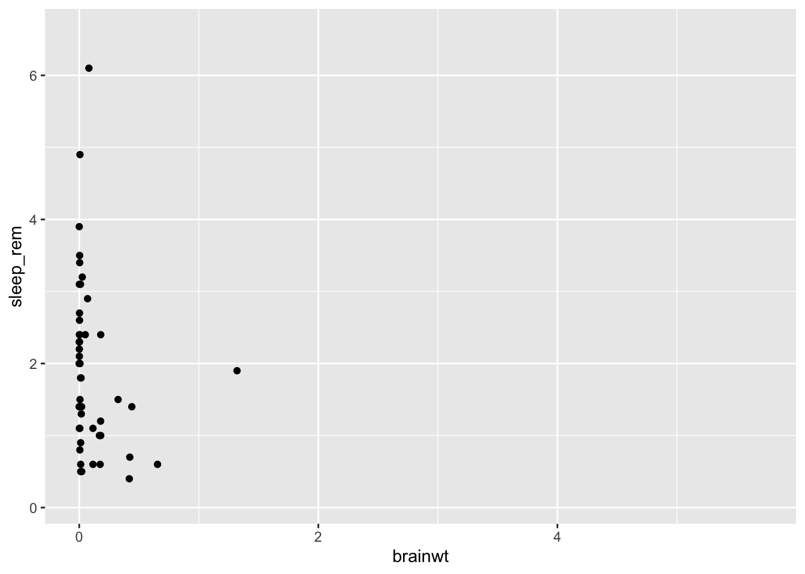

You might notice that all of the points are squished against the y-axis since many of the mammals in this dataset have low brain weights.


```r
summary(msleep$brainwt)
```

```
##    Min. 1st Qu.  Median    Mean 3rd Qu.    Max.    NA's 
## 0.00014 0.00290 0.01240 0.28158 0.12550 5.71200      27
```

As you can see with the `summary` function, the minimum and median values are very low, but there are a few mammals with high `brainwt` as you can see by the much larger maximum value in this vector.

To make more useful plots, we can transform this value using log-scaling. While we will have to note that the new values do not exactly match the real-world measurements anymore, patterns we see (i.e. something that correlates with higher brain weights) will still hold true.


```r
msleep2 <- msleep %>% mutate(brainwt_log = log(brainwt))
ggplot(msleep2, aes(x = brainwt_log, y = sleep_rem)) + geom_point()
```

```
## Warning: Removed 35 rows containing missing values (geom_point).
```

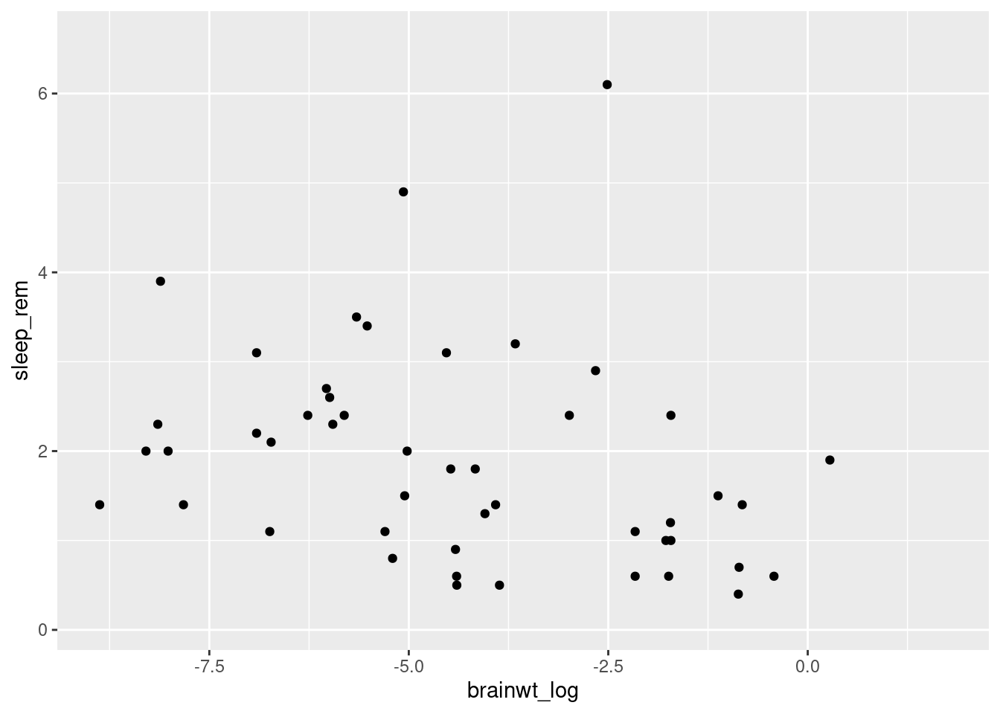

Here we use the `mutate` function to make a new variable called `brainwt_log` in our dataset (technically a new dataset copy that we have saved as `msleep2`). Plotting this variable as our x variable (i.e. independent variable), makes it easier to look for patterns (worksheet tasks 3.4.1B and 3.4.1C).

------

### Changing plot aesthetics

We can modify the appearance of the plot in two ways: either uniformly changing the appearance or having the appearance vary depending on information present in our data.

Let's explore how to modify our plots uniformly. We can change aspects of the points we plot such as transparency ("alpha") and color by supplying them as arguments in the `geom_point` function.


```r
ggplot(data = msleep2, aes(x = brainwt_log, y = sleep_rem)) +
    geom_point(alpha = 0.5, color = "blue")
```

```
## Warning: Removed 35 rows containing missing values (geom_point).
```

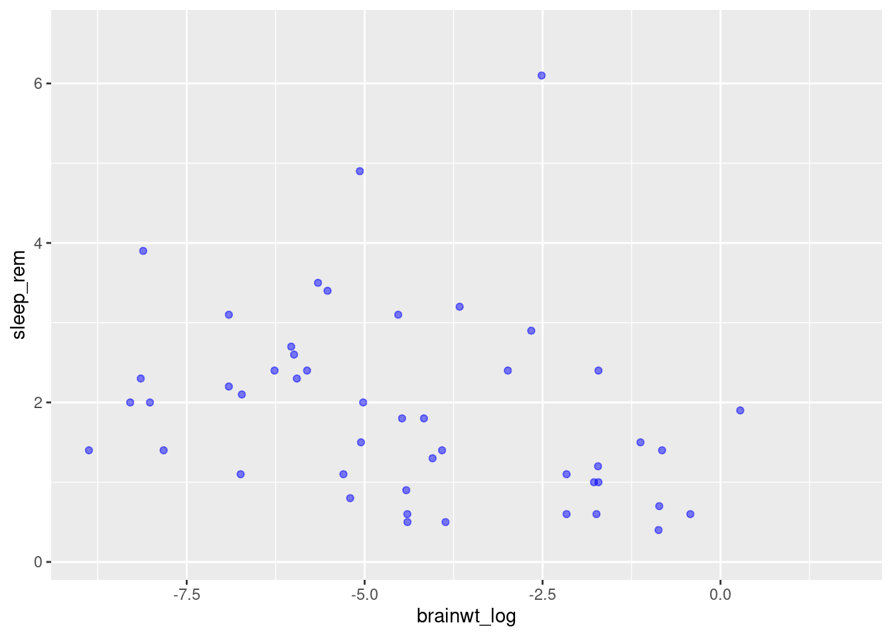

Here we have made the plots semi-transparent and colored blue. You can try varying these values (e.g. change blue to a different color). You can also supply other arguments such as `shape` to use something other than a dot (worksheet task 3.4.2A).

However, it is also possible to scale the color of the points by some variable present in the data. This approach means we can create a scatterplot that conveys more than just two variables' worth of information (x-axis and y-axis) by having the color reflect a third variable.

To do this, we specify the `color` inside the aesthetic mapping `aes` within the initial `ggplot` function. Same as how we told R to use a specific column by name for `x` or `y` coordinates, we specify which column to use for `color` (worksheet task 3.4.2B).


```r
ggplot(msleep2, aes(x = brainwt_log, y = sleep_rem, color = vore)) + 
  geom_point()
```

```
## Warning: Removed 35 rows containing missing values (geom_point).
```

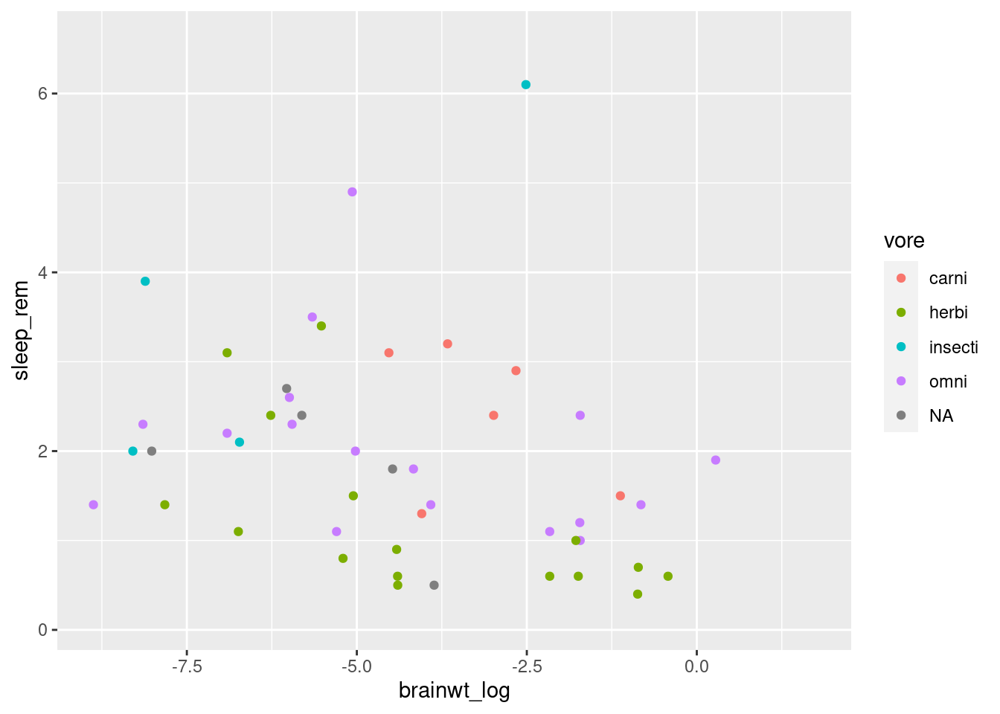

This plot conveys not only the relationship between `brainwt_log` and `sleep_rem`, but each plot representing a different mammal now conveys what the feeding behavior of that mammal is.

When generating visualizations, it is important to annotate the figure with meaningful labels on the axes to make them accessible for the viewer. For that, we can use the `labs` function (worksheet task 3.4.2C).


```r
ggplot(msleep2, aes(x = brainwt_log, y = sleep_rem, color = vore)) + 
  geom_point() + 
  labs(x = "Brain Weight (log)", 
       y = "Duration of REM Sleep",
       color = "Feeding Behavior")
```

```
## Warning: Removed 35 rows containing missing values (geom_point).
```

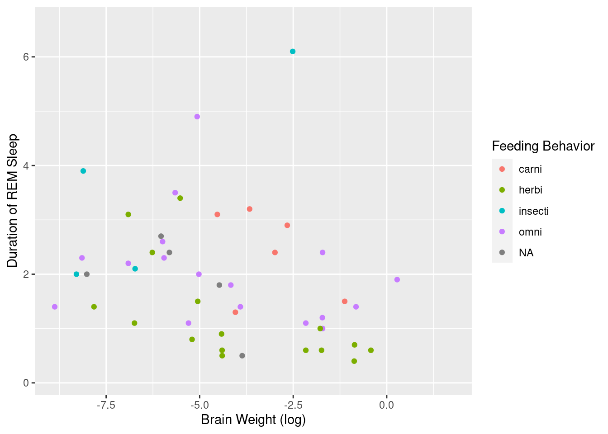

------

### Exploring simple plots

Let's consider how we make other plots besides a scatterplot.

Scatterplots are a great way to look at two quantitative (numerical) values at the same time to observe patterns (i.e. correlations) between the variables or to identify interesting outliers.

However, other plots may be more useful to look at differing numbers of variables (i.e. one quantitative variable) or different types of variables (i.e. qualitative or categorical data). Here, we discuss two types of single variable plots that look at either a quantitative variable (histogram) or a categorical variable (barplot).

We can create histograms in ggplot2 that are more aesthetically pleasing than the default `hist` function. This shows the distribution of one quantitative variable (worksheet tasks 3.4.3A and 3.4.3B).


```r
ggplot(msleep, aes(x = sleep_total)) +
    geom_histogram(bins = 10)
```

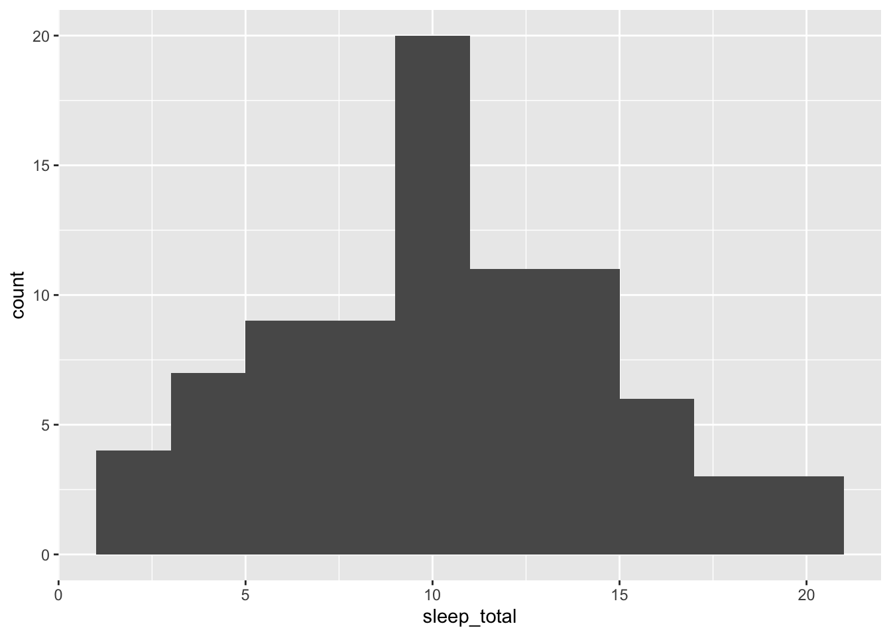

We can look at how many individuals in the dataset fall into each category, such as how many mammals have each kind of feeding behavior (worksheet task 3.4.3C).


```r
ggplot(data = msleep, aes(x = vore)) + 
  geom_bar()
```

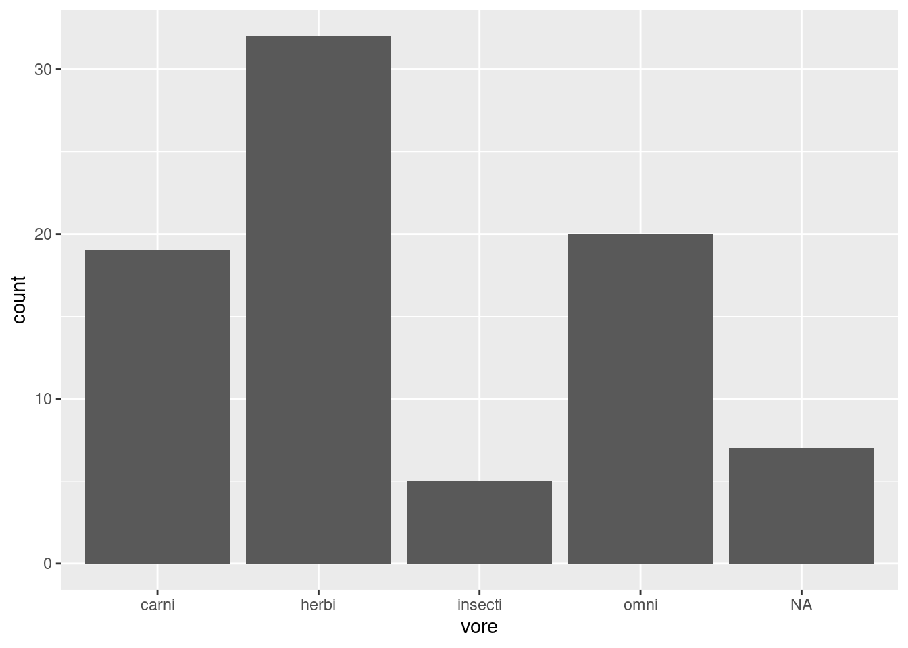

As you can see where we map the aesthetic, we only tell the `ggplot` function to refer to a single column in our dataset for our x-axis.

------

### Visualizing between groups

Let's return to `iris` dataset to explore how we can visualize differences between groups/categories. These groups are often represented in our data as a factor.

We can look at how the distributions of `Sepal.Length` differ depending on which species each iris belongs to. One plot that can do this easily is the `geom_boxplot` function (worksheet task 3.4.4A).


```r
ggplot(data = iris, aes(x = Species, y = Sepal.Length)) + 
  geom_boxplot()
```

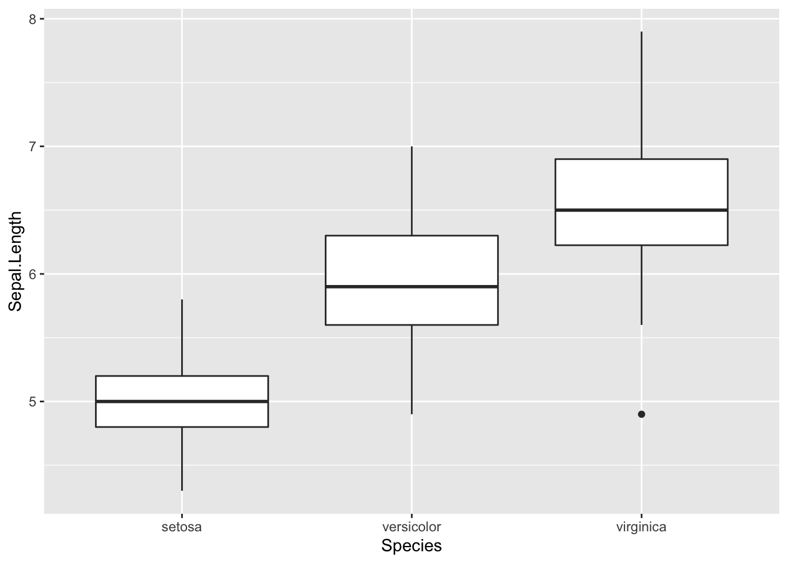

By adding a different parameter to `fill` in the `aes` we define throgh the `ggplot` function, we can separate out histograms according to different groupings. Here, we use `Species` to determine the color of the fill.


```r
ggplot(iris, aes(x = Sepal.Length, fill = Species)) +
    geom_histogram(bins = 10)
```

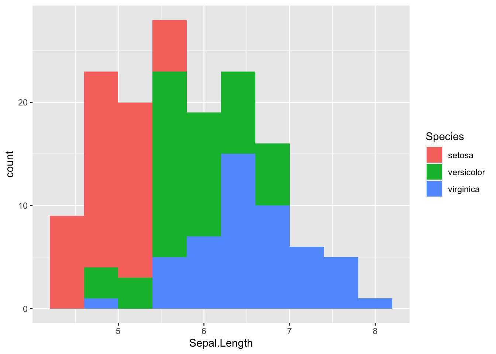

While we can sort of see the trends on this plot, it may be helpful to separate out each histogram for each individual species. There is an easy way to do this in `ggplot2` using facetting or the `facet_wrap` function. This function splits the figure into separate panel where the data has been filtered by the category (i.e. `Species`) (worksheet task 3.4.4B).


```r
ggplot(iris, aes(x = Sepal.Length, fill = Species)) +
    geom_histogram(bins = 10) +
  facet_wrap( ~ Species)
```

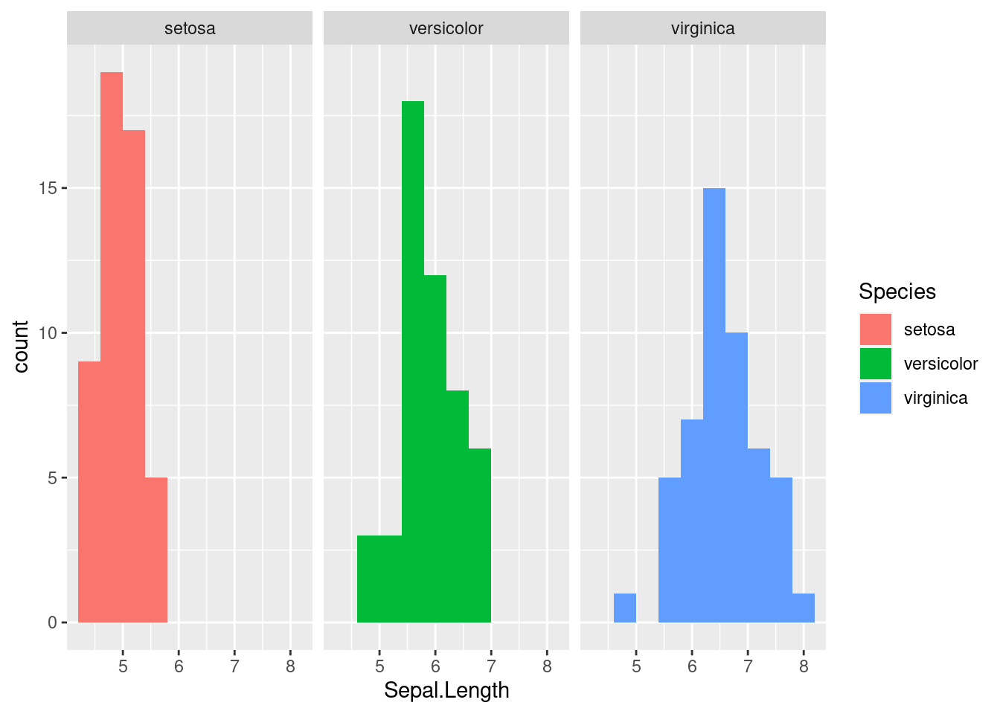

This matches what we already saw in the boxplot, showing that there are different sepal lengths depending on which iris species we look at. We will explore in the next section how we know if these differences are significant.

------

### Generating heatmaps (OPTIONAL)

If you are already familiar with ggplot2 or progress quickly through that material, you may consider reading this subsection. Otherwise, feel free to skip ahead!

Heatmaps are a useful way to show the values of multiple samples across many measurements. You can visualize a heatmap by thinking of your dataframe, this tabular data, if it had each cell colorcoded based on how high or low the value is.

The base R `heatmap` function meets many needs while the ggplot2 equivalent (`geom_tile`) can be confusing so we will recommend that you not use ggplot2 for heatmaps.

Let's go back to `msleep` dataset to visualize trends between the different measurements taken on each mammal. We will first create a simplified dataset from `msleep` where we take the log value of both `brainwt` and `bodywt` (worksheet task 3.4.5A).


```r
temp.data <- cbind(log(msleep$brainwt), log(msleep$bodywt))
head(temp.data)
```

```
##            [,1]       [,2]
## [1,]         NA  3.9120230
## [2,] -4.1669153 -0.7339692
## [3,]         NA  0.3001046
## [4,] -8.1456296 -3.9633163
## [5,] -0.8603831  6.3969297
## [6,]         NA  1.3480731
```

Next, we feed these numeric values into the `heatmap` function along with some arguments that specify settings for displaying the figure. We use `labCol` to specify how to label these columns and `cexCol` to control the text size of these labels. We set `labRow` to be the names of each species from the msleep dataset (worksheet task 3.4.5B).


```r
heatmap(temp.data, labRow = msleep$name, labCol = c("brainwt", "bodywt"), cexCol = 1)
```

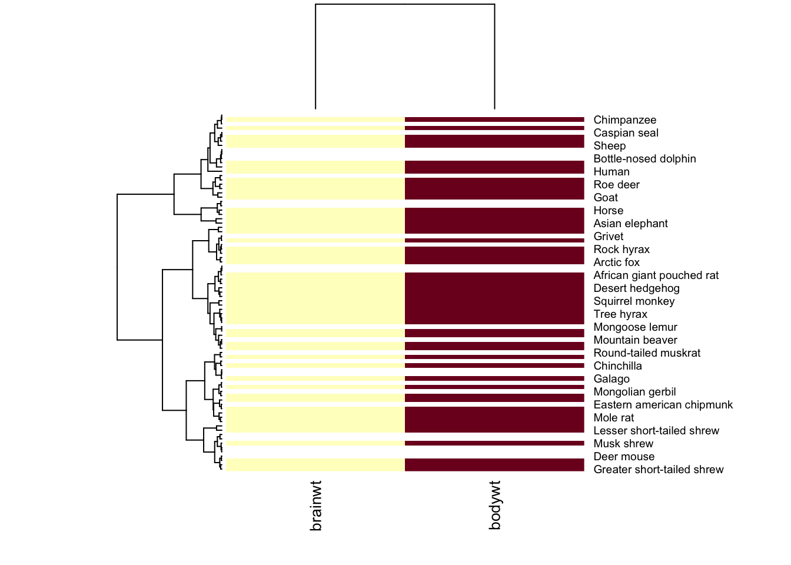

This first heatmap will look strange because it colors each box by its magnitude, but body weight of a mammal is always greater than its brain weight. We want to scale within each column so that the depth of the color reflects whether the mammal has a high brain weight or high body weight **relative to the other mammals** (worksheet task 3.4.5C).


```r
heatmap(temp.data, scale = "col", labRow = msleep$name, labCol = c("brainwt", "bodywt"), cexCol = 1)
```

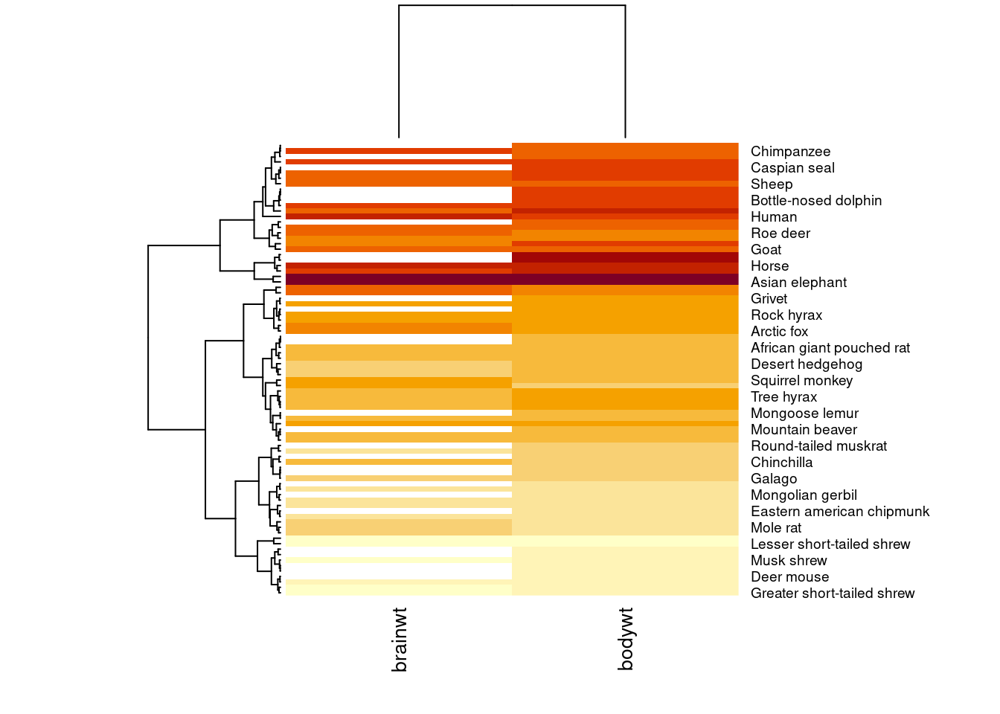

Using the `scale` argument which we set to `"col"`, now the color of the columns is more meaningful. For example, it makes sense that the measurements taken on an Asian elephant are much higher than those from a mole rat, so the color of those cells is deeper.

Let's add some more data to our heatmap visualization (worksheet task 3.4.5D and 3.4.5E).


```r
temp.data2 <- cbind(temp.data, msleep$sleep_total, msleep$sleep_rem)
heatmap(temp.data2, scale = "col", labRow = msleep$name,
        labCol = c("brainwt", "bodywt", "total_sleep", "rem_sleep"), cexCol = 1)
```

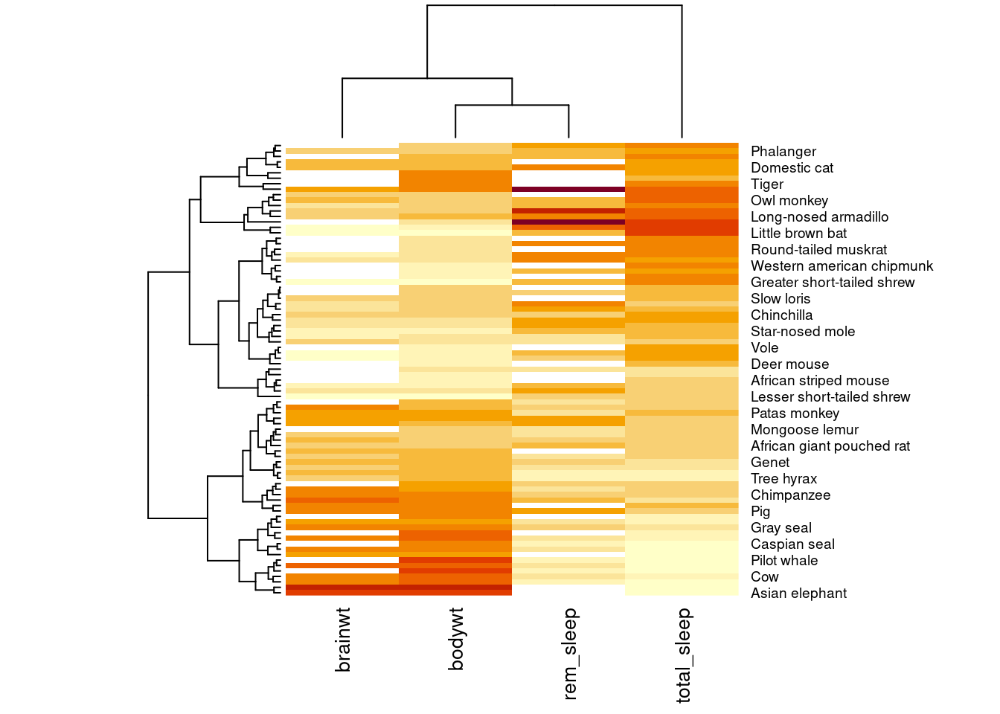

You may have noticed the weird diagrams along the top and left hand side of this heatmap. These strange line diagrams are trees that show how our samples cluster together. Mammals that have similar patterns of values across these four measurements are placed near each other in the diagram.
