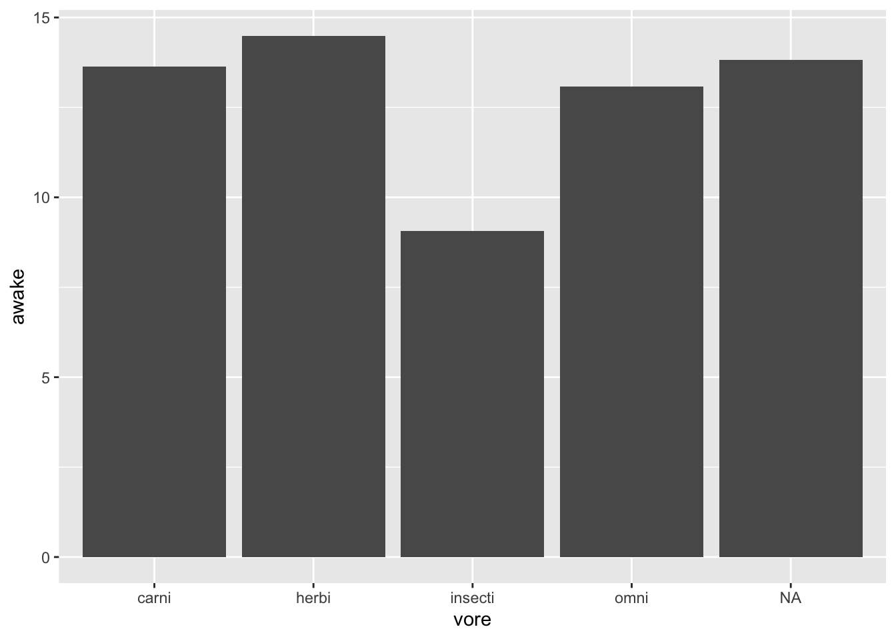
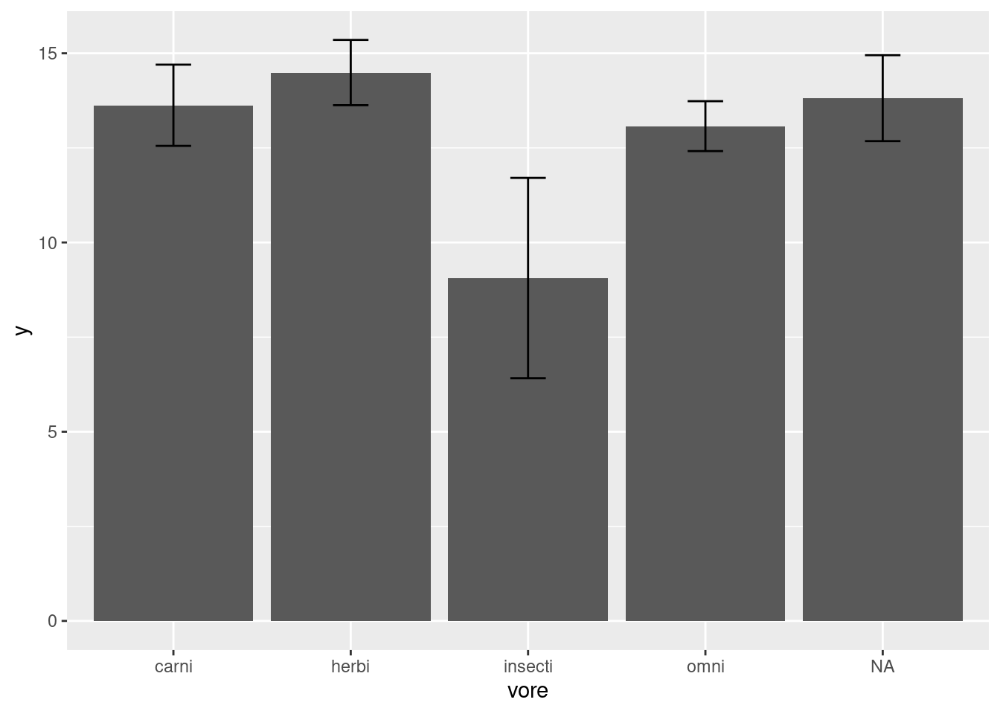
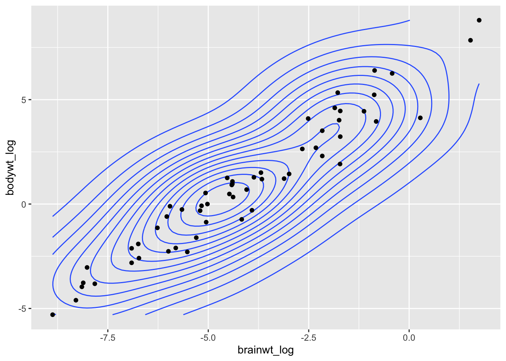
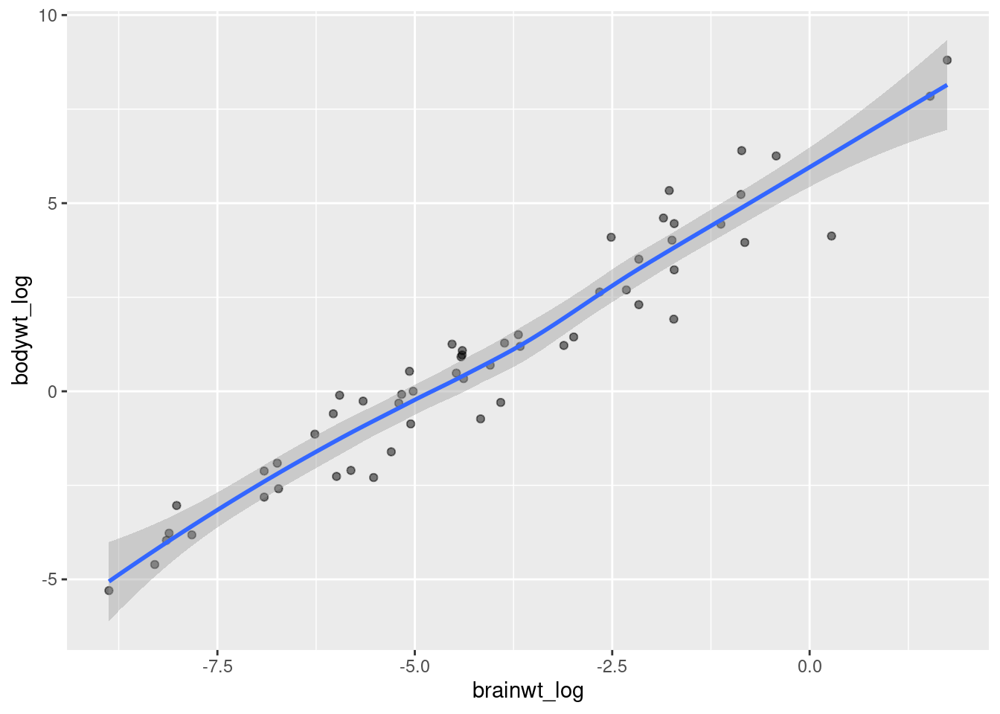
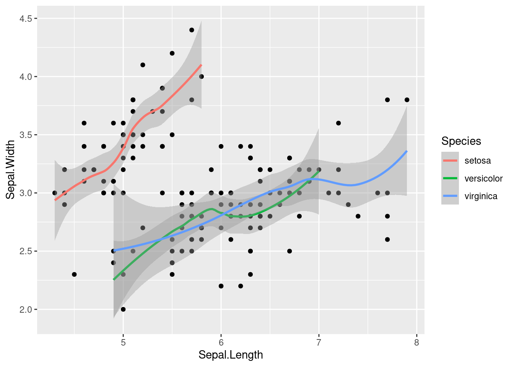
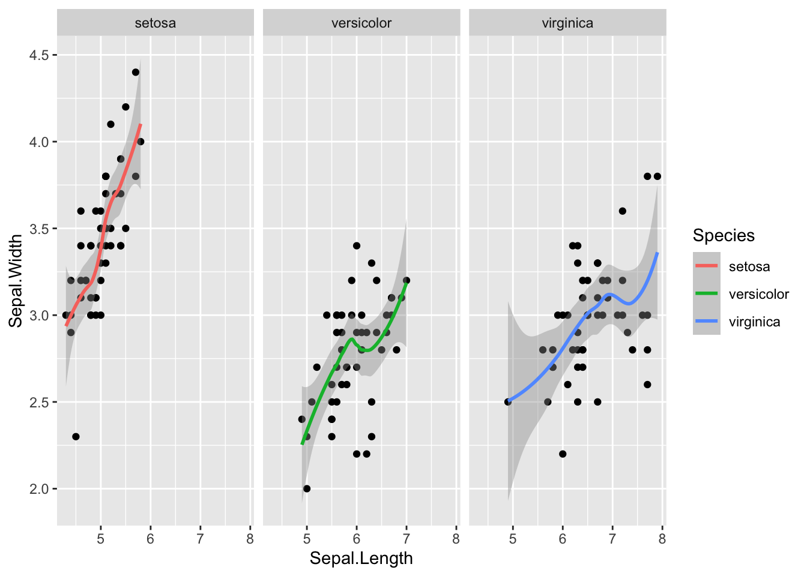

## Making scientific figures

Making plots can be a great way to develop an intuition for your dataset, though to derive and communicate scientific insights, we need to have an idea of the uncertainty in our interpretations.

Uncertainty describes ideas such as: are the values between two groups different enough, that it is unlikely that the differences are due to chance? Is the correlation between these variables strong enough that one can predict the other, with some level of confidence? **How statistically significant are the patterns we see?**


### Plotting error bars

When we compare measurements taken from two samples (i.e. two groups), we might want to see if the two groups have very different values for that specific measurement. If we have multiple observations within each group, we can take a summary statistic such as the mean or median and plot those against each other.


```r
ggplot(msleep2, aes(x = vore, y = awake)) + 
  geom_bar(stat = "summary", fun = "mean")
```



For example, here we have asked our `geom_bar` function to plot a summary, specifically the mean of each group, instead of plotting `identity` which usually means the value as is. Looking at this figure, we can't guess if the groups are significantly different without an idea of the uncertainty in our measurements through something like error bars. 

Here is the convention for plotting error bars in ggplot2, as you can see it is just another kind of geom that we can add to our plot:

`ggplot(data = <SUMMARY DATA>, mapping = aes(<SUMMARY MAPPINGS>) + geom_bar(stat = "identity") + geom_errorbar(aes(<ERROR MAPPINGS>))`

This method is straightforward, but you need to have pre-calculated the summary statistic for each group and the amount of error (i.e. standard error) from your data. That "aggregated" dataframe becomes the data that you provide to ggplot, instead of the original dataset (worksheet task 3.5.1A). 


```r
feeding.data <- msleep2 %>% group_by(vore) %>% 
  summarize(mean_se(awake))
feeding.data
```

```
## # A tibble: 5 x 4
##   vore        y  ymin  ymax
##   <chr>   <dbl> <dbl> <dbl>
## 1 carni   13.6  12.6   14.7
## 2 herbi   14.5  13.6   15.4
## 3 insecti  9.06  6.41  11.7
## 4 omni    13.1  12.4   13.7
## 5 <NA>    13.8  12.7   14.9
```

What does `mean_se` do? We can check.


```r
?mean_se
```

This function returns three values, `y`, `ymin`, and `ymax` which correspond to the mean, the mean minus one standard error, and the mean plus one standard error. The mean value will be the height of each bar on the barplot, while `ymin` corresponds to the bottom of the error bar and `ymax` to the top of the error bar.

Let's first plot the height of the bars using this new `feeding.data` dataset and mapping `y` to our new `y` column generated from the `mean_se` function. Here we create the same plot as before from this aggregated dataset, just showing the mean value in each group (worksheet task 3.5.1B).


```r
my.plot <- ggplot(feeding.data, aes(x = vore, y = y)) + 
  geom_bar(stat = "identity")
my.plot
```


Now we add the error bars, mapping the `ymin` and `ymax` values to the arguments that happen to have the same name in the `geom_errorbar` function. We add in the `width` setting just for aesthetics (worksheet tasks 3.5.1C and 3.5.1D).


```r
my.plot <- my.plot + geom_errorbar(aes(ymin = ymin, ymax = ymax),
                                   width = 0.2)
my.plot
```



Now it is more clear that insectivores have significantly less time awake compared to other kinds of mammals.

------

### Showing trends in data

Lots of these different figures summarize or aggregate the data. We may want to display the data with the individual points, but still show the overall trend across the data. Some good plots that do this are `geom_density_2d` which provides a contour plot.

Let's check out the trend in our `msleep` data between body weight and brain weight. We will create a new column where we take the log value of body weight, like we did with brain weight.


```r
msleep3 <- msleep2 %>% mutate(bodywt_log = log(bodywt))
ggplot(data = msleep3, mapping = aes(x = brainwt_log, y = bodywt_log)) +
  geom_density_2d() +
  geom_point()
```



As you can see the density of points almost look like they fit a line. As brain weight increases then body weight increases, or vice versa. We can add a trendline to this plot with the `geom_smooth` function (worksheet tasks 3.5.2A and 3.5.2B).


```r
ggplot(msleep3, aes(x = brainwt_log, y = bodywt_log)) +
  geom_point(alpha = 0.5) +
  geom_smooth()
```

```
## `geom_smooth()` using method = 'loess' and formula 'y ~ x'
```



We can also do this with trendlines that summarize only certain subsets of the data, such as those that belong to a specific category. We will flip back to our `iris` dataset to look at how sepal length compares to sepal width between different species of iris. 


```r
ggplot(data = iris, mapping = aes(x = Sepal.Length, y = Sepal.Width)) + 
  geom_point() +
  geom_smooth(aes(color = Species)) 
```

```
## `geom_smooth()` using method = 'loess' and formula 'y ~ x'
```



We create a seaprate trendline for each by specifiying the `aes` with color mapping to `Species` within the `geom_smooth` function.

The above plot may make it hard to see the data that is contributing to each trend line. Using `facet_wrap` again, we can split the figure into separate panel where the data has been filtered by the category (i.e. species) (worksheet task 3.5.2C).


```r
ggplot(data = iris, mapping = aes(x = Sepal.Length, y = Sepal.Width)) +
  geom_point() +
  geom_smooth(aes(color = Species)) +
  facet_wrap( ~ Species)
```

```
## `geom_smooth()` using method = 'loess' and formula 'y ~ x'
```



Now it is clear that there is a positive correlation (as one goes up, the other goes up) in each species of iris, but some species have a sharper upward trend than others.

------

### Saving figures locally

As you produce analysis in your research, you may want to create high-quality images of your figures to then use in presentations or publications. There are two easy ways to save images as an individual file on your computer (worksheet tasks 3.5.3A and 3.5.3B),

The first method uses `ggsave` to save the most recent ggplot figure you generated (worksheet task 3.5.3C).


```r
ggplot(msleep2, aes(x = brainwt_log, y = sleep_rem)) + geom_point() +
  geom_smooth(method = "lm")
ggsave("plot.png", width = 5, height = 5)
```

This function will save the figure just produced by this code wherever your directory is currently. You can check your current directory with `getwd()` and change with `setwd(<FOLDER NAME>)`. You can also provide a precise file path in the new file name.


```r
ggsave("~/Downloads/plot.png", width = 5, height = 5)
```

Here is an alternative method for saving your figures:


```r
pdf("plot.pdf") # creates the file
# png() also works if you want a different file format
ggplot(msleep2, aes(x = brainwt_log, y = sleep_rem)) + geom_point() +
  geom_smooth(method = "lm")
dev.off() # finishes editing the file
```

Any changes to the figure that are contained between the initial creation of the figure (i.e. the `pdf` command) and the `dev.off` command will be included in the final saved image (worksheet task 3.5.3D). However, the figure is being printed directly to the file it is writing and won't appear elsewhere (worksheet task 3.5.3E).
