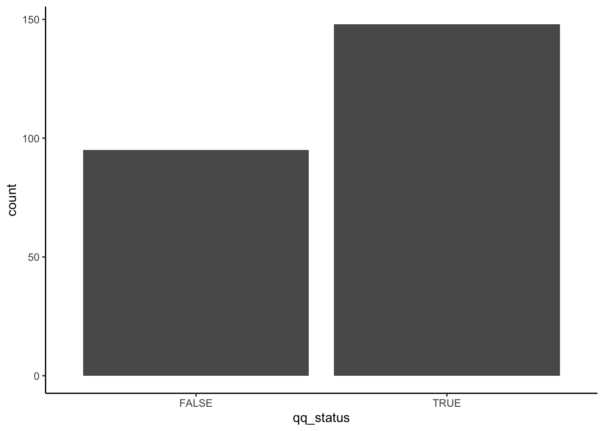

## Analyzing viral protein sequences

Let's practice with starting a project.

Viral structural proteins are dramatically more important to the general
public than they were 2 years ago - and under much more public attention. 
Let's take a cursory look at some of these.

What kind of data are we using for this?
We'll retrieve some determined protein sequences from NCBI databases.
We've already done that work for you already. Here's a short writeup of
what we did, amd we would recommend that you
always document where the data came from and how it was retrieved/processed:

> The NCBI Identical Protein Groups database was queried for "structural"
> with "Division" restricted to "Viruses" and "Source database" restricted
> to "UniProtKB/Swiss-Prot". 243 results were retrieved as FASTA files and 
> converted using bash commands into separate tab-delimited files.
^[One crucial aspect missing is the actual bash commands used. I did not
    save them as a script, and I *should* go back, save them in a script,
    and re-run that to make sure I get the same result!]

What format are these in?
These files are in the `data/viral_structural_proteins` folder,
they end in `.tsv`, are tab-delimited three fields, and look like this:

    Q8V433.1 Membrane protein       Bovine respiratory coronavirus (strain 98TXSF-110-LUN)  MSSVTTPAPVYTWTA...

This is not a standard format, because I'd like to tell y'all about
reading tab-delimited files.
^[The formats you're likely going to have to deal with are CSV, TSV,
    FASTQ, FASTA, SAM - at least. ]

One trick to look at files using R is using `readLines()` function.
This just reads lines, up to the argument `n=` number of lines.
Try something like:


```r
readLines("data/viral_structural_proteins/viral_proteins_242.tsv",n=5)
```

```
## [1] "YP_009724393.1 membrane glycoprotein \tSevere acute respiratory syndrome coronavirus 2\tMADSNGTITVEELKKLLEQWNLVIGFLFLTWICLLQFAYANRNRFLYIIKLIFLWLLWPVTLACFVLAAVYRINWITGGIAIAMACLVGLMWLSYFIASFRLFARTRSMWSFNPETNILLNVPLHGTILTRPLLESELVIGAVILRGHLRIAGHHLGRCDIKDLPKEITVATSRTLSYYKLGASQRVAGDSGFAAYSRYRIGNYKLNTDHSSSSDNIALLVQ"
```

Whenever using these commands, put your cursor in the quotes and then hit TAB,
to use autocomplete.

Let's do two things. Let's count how long the protein sequences are, so
we can look at that distribution. Let's also look for particular combinations
of amino acids.

Some folks are quite interested in the insertion of an amino-acid sequence 
of `PRRA`, relative to other related coronaviruses, in the SARS-CoV-2 genome.
I don't know hardly anything about furin-cleavage sites or viral evolution,
but since this is an introductory R class, 
we can use the tools we have to look for this sequence in the files.
Let's do that^[
    ...since we're just demonstrating R coding and not representing ourselves as 
    being familiar enough with the field to properly interpret these results.
    I have no idea what occurance of this would mean or not mean, or are we
    doing any sort of statistics or comparisons to null expectations.]

How?

---

### Reading in tab-delimited file

Let's read one of them into R.

The records are "delimited" by tabs, so each field is tab-separated.
We'll need to use the `read.delim` function and specify a tab separator.

---

#### Review of looking up documentation

You can look up the documentation for any named function or package by using
the `?function` syntax.

Sometimes, you need to use extra backticks to make it work, like `` ?`+` ``

If you don't know what you're looking for, you can search with `??`.
Extra backticks don't hurt, and are necessary when you have spaces in the 
query.

Once the documentation is open, you can search for text.
If you are using the R console, you can use `/` to open a search bar and 
enter-key to search for it.

---

#### Back to the file-reading...

We can use `read.delim` to read in one of the files.
You will have to specify the delimiter/separator.
"\t" is usually how you specify a TAB character in character strings, like
you would set as that argument.

```{=html}
<div class="incremental">
```


```r
viral_protein_data <- read.delim("data/viral_structural_proteins/viral_proteins_100.tsv",
    sep="\t",header=F)
viral_protein_data
```

```
##                           V1
## 1 Q8V433.1 Membrane protein 
##                                                       V2
## 1 Bovine respiratory coronavirus (strain 98TXSF-110-LUN)
##                                                                                                                                                                                                                                       V3
## 1 MSSVTTPAPVYTWTADEAIKFLKEWNFSLGIILLFITVILQFGYTSRSMFVYVIKMIILWLMWPLTIILTIFNCVYALNNVYLGFSIVFTIVAIIMWIVYFVNSIRLFIRTGSWWSFNPETNNLMCIDMKGRMYVRPIIEDYHTLTVTIIRGHLYMQGIKLGTGYSLSDLPAYVTVAKVSHLLTYKRGFLDKIGDTSGFAVYVKSKVGNYRLPSTQKGSGLDTALLRNNI
```

What type is that third column?


```r
is(viral_protein_data$V3)
```

```
## [1] "factor"              "integer"             "oldClass"           
## [4] "double"              "numeric"             "vector"             
## [7] "data.frameRowLabels"
```

Huh, looks like it'll convert it to a factor automatically. Let's tell it to 
not do that, to leave it `as.is`.


```r
viral_protein_data <- read.delim("data/viral_structural_proteins/viral_proteins_100.tsv",
    sep="\t",header=F,as.is=T)
viral_protein_data
```

```
##                           V1
## 1 Q8V433.1 Membrane protein 
##                                                       V2
## 1 Bovine respiratory coronavirus (strain 98TXSF-110-LUN)
##                                                                                                                                                                                                                                       V3
## 1 MSSVTTPAPVYTWTADEAIKFLKEWNFSLGIILLFITVILQFGYTSRSMFVYVIKMIILWLMWPLTIILTIFNCVYALNNVYLGFSIVFTIVAIIMWIVYFVNSIRLFIRTGSWWSFNPETNNLMCIDMKGRMYVRPIIEDYHTLTVTIIRGHLYMQGIKLGTGYSLSDLPAYVTVAKVSHLLTYKRGFLDKIGDTSGFAVYVKSKVGNYRLPSTQKGSGLDTALLRNNI
```

```r
is(viral_protein_data$V3)
```

```
## [1] "character"           "vector"              "data.frameRowLabels"
## [4] "SuperClassMethod"
```

This is how you do it in base R. How do you do this in tidyverse?
You can use `read_delim` or `read_tsv`, with different arguments,
such as `col_names=F` to prevent it from reading the first line as a header.
Also, no factor conversion :) 


```{=html}
</div>
```

---


### String stuff

Once we have that, we can test how we will process the protein sequence.
For now, let's just calculate the length of the protein sequence.

Character strings are a common type of data, and there's lots of ways to
cut, dice, extract, and recognize elements to help your work.
Here's some tools/ideas:

#### Base R tools

Let's start with one of those above sentences.
You can make a string by putting characters in between single or double quotes:


```r
stringz <- "Character strings are a common type of data, and there's lots of ways to"
stringz
```

```
## [1] "Character strings are a common type of data, and there's lots of ways to"
```

```r
is(stringz)
```

```
## [1] "character"           "vector"              "data.frameRowLabels"
## [4] "SuperClassMethod"
```

```r
str(stringz)
```

```
##  chr "Character strings are a common type of data, and there's lots of ways to"
```

`grep` and `grepl` are good for searching for patterns (like `grep` in bash).
The first returns position, the second returns `TRUE` or `FALSE`.

I only ever use `grepl` anymore. It searches for a `pattern` string
in a character vector `x`, and returns a logical vector.
With a logical vector, you can do a lot, like indexing/slicing or sum-ing.


```r
grepl(pattern="common type",x=stringz)
```

```
## [1] TRUE
```

```r
grepl("rare type",stringz)
```

```
## [1] FALSE
```

```r
grepl(" [comn]* type",stringz)
```

```
## [1] TRUE
```

So see that last one with the `[]*` stuff?
Called a regular expression.
You can use complex 
[regular expressions](https://bookdown.org/rdpeng/rprogdatascience/regular-expressions.html)
to specify more complex patterns.
These can get 
[really complex](https://r4ds.had.co.nz/strings.html#matching-patterns-with-regular-expressions)
and [really powerful](https://cs.lmu.edu/~ray/notes/regex/).
We're not going to explain these here, except just for the example below.

Ask on Slack later if you'd like more help with something specific.

Also of use is `sub` and `gsub`. 
These substitute patterns with replacements, for the
first occurrence (`sub`) or globally (`gsub`).
These are really handy for modifying data-tables.

For example, let's say you'd like to split up filenames by dates:


```r
datar <- data.frame(stringsAsFactors=F,
    filenames=c(
        "210607_pilot_transformation_works.jpeg",
        "210609_transformation_seems_to_work.jpeg",
        "210610_failed_gel_images.jpeg"
    )
)
datar$dates <- gsub(pattern="(\\d\\d\\d\\d\\d\\d)_(.*)\\.jpeg",
        replacement="\\1",x=datar$filenames)
datar$names <- gsub(pattern="(\\d\\d\\d\\d\\d\\d)_(.*)\\.jpeg",
        replacement="\\2",x=datar$filenames)
datar
```

```
##                                  filenames  dates                        names
## 1   210607_pilot_transformation_works.jpeg 210607   pilot_transformation_works
## 2 210609_transformation_seems_to_work.jpeg 210609 transformation_seems_to_work
## 3            210610_failed_gel_images.jpeg 210610            failed_gel_images
```

The above uses regular expressions, where `\\d` is matching any digit, 
`.*` matches anything, and `()` denote "groups" to "capture".
In the "replacement", these "groups" are referred to by `\\1` or `\\2`.

These "capture groups" are **super useful**!
You can use them to take out matches and re-arrange them.

So, `(\\d\\d\\d\\d\\d\\d)_` matches six digits followed by an underscore,
such as `210618_`, and saves it as `\\1`.  So


```r
gsub(pattern="(\\d\\d\\d\\d\\d\\d)_(.*)",replacement="\\1",x="210616_after")
```

```
## [1] "210616"
```

```r
gsub(pattern="(\\d\\d\\d\\d\\d\\d)_(.*)",replacement="\\2",x="210616_after")
```

```
## [1] "after"
```

There are better (cleaner) ways of doing this with tidyverse, 
basics are important. See a bit of tidyverse/stringr stuff in the end of this 
4.2 section, if you're curious.

You should now be able to manipulate within character strings a bit,
identify and replace patterns.


---

### Loops - doing a similar task multiple times

You will want to repeat this analysis for all the files.
The simplest way of doing this is to copy and paste it, and change the filename.


```r
viral_protein_data <- read.delim("data/viral_structural_proteins/viral_proteins_002.tsv",
      sep="\t",header=F, as.is=T)
nchar(viral_protein_data$V3)
```

```
## [1] 177
```

```r
viral_protein_data <- read.delim("data/viral_structural_proteins/viral_proteins_003.tsv",
      sep="\t",header=F, as.is=T)
nchar(viral_protein_data[1,"V3"])
```

```
## [1] 137
```

Go ahead and do this for all 242 proteins 

---

... just kidding.

This is a lot of work, and each time we do this we can introduce errors.
If we ever have more files, we have to copy and paste more. If we ever want
to change an argument for all of them, we have to do each one.

Instead, we can work with a list of all the files available:


```r
list.files(path="data/viral_structural_proteins")[1:5]
```

```
## [1] "viral_proteins_000.tsv" "viral_proteins_001.tsv" "viral_proteins_002.tsv"
## [4] "viral_proteins_003.tsv" "viral_proteins_004.tsv"
```

Note that I put a `[1:5]` to limit it to the first 5.
You could also use `head()`. It's a good idea to work
with a small subset of files while you are iterating
through development, then scale it up to the entirety.

But watch out...


```r
tail(list.files(path="data/viral_structural_proteins"))
```

```
## [1] "viral_proteins_238.tsv"          "viral_proteins_239.tsv"         
## [3] "viral_proteins_240.tsv"          "viral_proteins_241.tsv"         
## [5] "viral_proteins_242.tsv"          "viral_structural_proteins.fasta"
```

At the very end is another different file, a FASTA file.
So let's use a `pattern`
argument in `list.files` to specify what we want to list.
And we'll get back to the FASTA later...


```r
tail(list.files(path="data/viral_structural_proteins",pattern=".*tsv"))
```

```
## [1] "viral_proteins_237.tsv" "viral_proteins_238.tsv" "viral_proteins_239.tsv"
## [4] "viral_proteins_240.tsv" "viral_proteins_241.tsv" "viral_proteins_242.tsv"
```

`.*` stands for 0 or more (`*`) of anything (`.`). For more details,
look up regular-expressions.

---

#### What are loops?

<!-- video -->

Loops are for running a "code block" as many times
as the "condition" determines.

- A "code block" is either one line of code, or multiple
    lines of code surrounded by curly brackets - {}

        {
            code <- "in a block" 
            with <- "multiple lines" 
        }

    The code just runs. Yep. It's that simple.

- A "condition" is an expression of code that
    can either evaluate to either `TRUE` or `FALSE`, or 
    set a variable for each time running the code block.
    This is often just before the code block, in `()` parentheses.

The most common form of these kind of "control statements" is a `for` loop.
Other "control statements" or "flow control statements" are
`while`, `repeat`, and `if`.

Let's look up what they do, with `` ?`for` ``
Note the back ticks! These are a trick in R to make anything
be interpreted as literally what you type, and not
any special characters. Like `` ?`+` ``, or `` ?`?` ``

---

Here's an example loop:


```r
for (i in 1:4) {
  print(i)
}
```

```
## [1] 1
## [1] 2
## [1] 3
## [1] 4
```

The pieces:

- `(i in 1:4)` is what is being looped over - `1:4` is a vector of 
  1 through 4 that is created, and it is put one at a time into `i` 
  (a new variable). You need the parentheses.
  
- `{` and `}` denote the opening and closing brackets, specify the
  "code block" that is run each time.
  
- inside this "code block" is `print(i)` - it prints the variable `i`,
  which is set to a value of 1, 2, 3, or 4 for each loop

[More about loops](http://swcarpentry.github.io/r-novice-inflammation/15-supp-loops-in-depth/index.html)


```{=html}
<div class="incremental">
```


```r
for (i in list.files(path="data/viral_structural_proteins",
        pattern=".*tsv")[1:5] ) {
  print(i)
}
```

```
## [1] "viral_proteins_000.tsv"
## [1] "viral_proteins_001.tsv"
## [1] "viral_proteins_002.tsv"
## [1] "viral_proteins_003.tsv"
## [1] "viral_proteins_004.tsv"
```

Inside the code block we can do more than print, like looking for a motif.
Here, we'll *try* to read the file and take a look at the sequence ...


```r
for (i in list.files(path="data/viral_structural_proteins",
        pattern=".*tsv")[1:5] ) {
  print(i)
  print(read.delim(i)$V3)
}
```

```
## [1] "viral_proteins_000.tsv"
```

```
## Warning in file(file, "rt"): cannot open file 'viral_proteins_000.tsv': No such
## file or directory
```

```
## Error in file(file, "rt"): cannot open the connection
```

```{=html}
</div>
```

Error! It is looking for a file `viral_proteins_000.tsv`, but it is looking
in _this directory_. It is actually in `data/viral_structural_proteins`.
Look up the `list.files` documentation, and find how to get it to return
the full name of the file.
 
---

Next, this should work...


```r
for (i in list.files(path="data/viral_structural_proteins",
        pattern=".*tsv",full.names=T)[1:5] ) {
  print(read.delim(i,sep="\t",header=F,as.is=T)$V3)
}
```

```
## [1] "MEFIPTQTFYNRRYQPRPWTPRPTIQVIRPRPRPQRQAGQLAQLISAVNKLTMRAVPQQKPRRNRKNKKQKQKQQAPQNNTNQKKQPPKKKPAQKKKKPGRRERMCMKIENDCIFEVKHEGKVTGYACLVGDKVMKPAHVKGTIDNADLAKLAFKRSSKYDLECAQIPVHMKSDASKFTHEKPEGYYNWHHGAVQYSGGRFTIPTGAGKPGDSGRPIFDNKGRVVAIVLGGANEGARTALSVVTWNKDIVTKITPEGAEEWSLAIPVMCLLANTTFPCSQPPCIPCCYEKEPEETLRMLEDNVMRPGYYQLLQASLTCSPHRQRRSTKDNFNVYKATRPYLAHCPDCGEGHSCHSPVALERIRNEATDGTLKIQVSLQIGIGTDDSHDWTKLRYMDNHIPADAGRAGLFVRTSAPCTITGTMGHFILARCPKGETLTVGFTDSRKISHSCTHPFHHDPPVIGREKFHSRPQHGKELPCSTYVQSNAATAEEIEVHMPPDTPDRTLLSQQSGNVKITVNGRTVRYKCNCGGSNEGLITTDKVINNCKVDQCHAAVTNHKKWQYNSPLVPRNAELGDRKGKIHIPFPLANVTCMVPKARNPTVTYGKNQVIMLLYPDHPTLLSYRSMGEEPNYQEEWVTHKKEVVLTVPTEGLEVTWGNNEPYKYWPQLSANGTAHGHPHEIILYYYELYPTMTVVVVSVASFILLSMVGMAVGMCMCARRRCITPYELTPGATVPFLLSLICCIRTAKAATYQEAAVYLWNEQQPLFWLQALIPLAALIVLCNCLRLLPCCCKTLAFLAVMSIGAHTVSAYEHVTVIPNTVGVPYKTLVNRPGYSPMVLEMELLSVTLEPTLSLDYITCEYKTVIPSPYVKCCGTAECKDKNLPDYSCKVFTGVYPFMWGGAYCFCDAENTQLSEAHVEKSESCKTEFASAYRAHTASASAKLRVLYQGNNITVTAYANGDHAVTVKDAKFIVGPMSSAWTPFDNKIVVYKGDVYNMDYPPFGAGRPGQFGDIQSRTPESKDVYANTQLVLQRPAAGTVHVPYSQAPSGFKYWLKERGASLQHTAPFGCQIATNPVRAMNCAVGNMPISIDIPDAAFTRVVDAPSLTDMSCEVPACTHSSDFGGVAIIKYAVSKKGKCAVHSMTNAVTIREAEIEVEGNSQLQISFSTALASAEFRVQVCSTQVHCAAECHPPKDHIVNYPASHTTLGVQDISATAMSWVQKITGGVGLVVAVAALILIVVLCVSFSRH"
## [1] "MFPFQPMYPMQPMPYRNPFAAPRRPWFPRTDPFLAMQVQELTRSMANLTFKQRRGAPPEGPPAKKSKREAPQKQRGGQRKKKKNEGKKKAKTGPPNLKTQNGNKKKTNKKPGKRQRMVMKLESDKTFPIMLEGKINGYACVVGGKLFRPMHVEGKIDNDVLAALKTKKASKYDLEYADVPQNMRADTFKYTHEKPQGYYSWHHGAVQYENGRFTVPRGVGARGDSGRPILDNQGRVVAIVLGGVNEGSRTALSVVMWNEKGVTVKYTPENCEQWSLVTTMCLLANVTFPCAQPPICYDRKPAETLAMLSANVDNPGYDELLKAAVTCPGRKRRSTEELFKEYKLTRPYMARCVRCAVGSCHSPIAIEAVKSDGHDGYVRLQTSSQYGLDPSGNLKSRTMRYNMYGTIEEIPLHQVSLHTSRPCHIVDGHGYFLLARCPAGDSITMEFKKDSVTHSCSVPYEVKFNPVGRELYTHPPEHGAEQACQVYAHDAQNRGAYVEMHLPGSEVDSSLVSLSSGLVSVTPPAGTSALVECECSGTTISKTINKTKQFSQCTKKEQCRAYRLQNDKWVYNSDKLPKAAGATLKGKLHVPFLLADGKCTVPLAPEPMITFGFRSVSLKLHPKYPTYLTTRELADEPHYTHELISEPSVRNFSVTAKGWEFVWGNHPPKRFWAQETAPGNPHGLPHEVIVHYYHRYPMSTITGLSICAAIVAVSIAASTWLLCRSRASCLTPYRLTPNAKMPLCLAVLCCARSARAETTWESLDHLWNNNQQMFWTQLLIPLAALIVVTRLLKCMCCVVPFLVVAGAAGAGAYEHATTMPNQAGISYNTIVNRAGYAPLPISITPTKIKLIPTVNLEYVTCHYKTGMDSPTIKCCGSQECTPTYRPDEQCKVFAGVYPFMWGGAYCFCDTENTQISKAYVMKSEDCLADHAAAYKAHTASVQALLNITVGEHSTVTTVYVNGETPVNFNGVKLTAGPLSTAWTPFDRKIVQYAGEIYNYDFPEYGAGQPGAFGDIQLRTVSSSDLYANTNLVLQRPKAGAIHVPYTQAPSGFEQWKKDKAPSLKFTAPFGCEIYTNPIRAENCAVGSIPLAFDIPDALFTRVSETPTLSAAECTLNECVYSSDFGGIATVKYSASKSGKCAVHVPSGTATLKEASVELAEQGSVTIHFSTANIHPEFRLQICTSFVTCKGDCHPPKDHIVTHPQYHAQTFTAAVSKTAWTWLTSLLGGSAVIIIIGLVLATLVAMYVLTNQKHN"
## [1] "MFNIKMTISTLLIALIILVIIILVVFLYYKKQQPPKKVCKVDKDCGSGEHCVRGTCSTLSCLDAVKMDKRNIKIDSKISSCEFTPNFYRFTDTAADEQQEFGKTRHPIKITPSPSESHSPQEVCEKYCSWGTDDCTGWEYVGDEKEGTCYVYNNPHHPVLKYGKDHIIALPRNHKHA"
## [1] "MEAVLTKLDQEEKKALQNFHRCAWEETKNIINDFLEIPEERCTYKFNSYTKKMELLFTPEFHTAWHEVPECREFILNFLRLISGHRVVLKGPTFVFTKETKNLGIPSTINVDFQANIENMDDLQKGNLIGKMNIKEG"
## [1] "MAFLMSEFIGLGLAGAGVLSNALLRRQELQLQKQALENGLVLKADQLGRLGFNPNEVKNVIVGNSFSSNVRLSNMHNDASVVNAYNVYNPASNGIRKKIKSLNNSVKIYNTTGESSV"
```

And yep, we have protein sequences.
Now looking for some amino acids:


```r
for (i in list.files(path="data/viral_structural_proteins",
        pattern=".*tsv",full.names=T)[1:5] ) {
  print(grepl("QQ",read.delim(i,sep="\t",header=F,as.is=T)$V3))
}
```

```
## [1] TRUE
## [1] TRUE
## [1] TRUE
## [1] FALSE
## [1] FALSE
```

---


### Storing values from a loop

First, how can we store the filenames and use them later for the loop?
We need to turn out list of files into indicies.
We'll save it first so we can count how many there are.

`seq_along` is handy function to create a number sequence along a vector, 
otherwise use something like `seq(1,length(x))`.


```r
# listing files
first_five <- list.files(path="data/viral_structural_proteins",pattern=".*tsv")[1:5]

length(first_five)
```

```
## [1] 5
```

```r
# looping through files
for (i in seq_along(first_five) ) {
    print(i)
    print(first_five[i])
}
```

```
## [1] 1
## [1] "viral_proteins_000.tsv"
## [1] 2
## [1] "viral_proteins_001.tsv"
## [1] 3
## [1] "viral_proteins_002.tsv"
## [1] 4
## [1] "viral_proteins_003.tsv"
## [1] 5
## [1] "viral_proteins_004.tsv"
```

---

Okay, but how do we store values for later analysis?

In other languages, "append". But R is not built that way. It'll work 
(using something like `append`, or `x <- c(x, new_value)`),
but it's inefficient. The "R-way" to store values from a loop
is to define a vector of the right length, then put each element in it.

Here's some example vectors that we can create.


```r
vector("character",10)
```

```
##  [1] "" "" "" "" "" "" "" "" "" ""
```

```r
vector(mode="numeric",length=5)
```

```
## [1] 0 0 0 0 0
```

```r
vector("logical",2)
```

```
## [1] FALSE FALSE
```

You can save these to a variable, and thus have a character vector,
numeric vector, or logical vector, of different sizes.

---

Putting these together, we can create and save a vector of file names:


```r
# listing files
first_five <- list.files(path="data/viral_structural_proteins",pattern=".*tsv")[1:5]
# initializing vectors
filenamez <- vector("character",length(first_five))

# looping through files
for (i in seq_along(first_five) ) {
  filenamez[i] <- first_five[i]
}

filenamez
```

```
## [1] "viral_proteins_000.tsv" "viral_proteins_001.tsv" "viral_proteins_002.tsv"
## [4] "viral_proteins_003.tsv" "viral_proteins_004.tsv"
```


---

And finally calculate the length of each protein:
And


```r
# listing files
first_five <- list.files(path="data/viral_structural_proteins",
                         full.names=T, pattern=".*tsv")[1:5]
# initializing vectors
has_qq <- vector("logical",length(first_five))

# looping through files
for (i in seq_along(first_five) ) {
  # calculating length and storing it
  has_qq[i] <- grepl( "QQ", read.delim(first_five[i],
      header=F,as.is=T,sep="\t")$V3
    )
}

has_qq
```

```
## [1]  TRUE  TRUE  TRUE FALSE FALSE
```

---

Now we can take off the `[1:5]` limiter, and do the whole set:


```r
# listing files
filez <- list.files(path="data/viral_structural_proteins",
                         full.names=T, pattern=".*tsv")

# initializing vectors
has_qq <- vector("logical",length(filez))

# looping through files
for (i in seq_along(filez) ) {
  # calculating length and storing it
  has_qq[i] <- grepl( "QQ", read.delim(filez[i],
      header=F,as.is=T,sep="\t")$V3
    )
}

has_qq[1:10]
```

```
##  [1]  TRUE  TRUE  TRUE FALSE FALSE  TRUE FALSE FALSE  TRUE FALSE
```

---

How many proteins have "QQ"? Cool trick for logical vectors, `sum`.


```r
sum(has_qq)
```

```
## [1] 148
```

```r
table(has_qq)
```

```
## has_qq
## FALSE  TRUE 
##    95   148
```

---

Can also ggplot it, for fun:


```r
library(ggplot2)
ggplot( data.frame(qq_status=has_qq) )+
    theme_classic()+
    aes(x=qq_status)+
    geom_bar()
```



---

### Extending the workflow

How do you think about/plan the workflow we've built?

How is it organized?

One way is to flatten out all the tasks, 
and to script each individual task every time it is done.
This requires the author, user, and reader to understand a lot of complexity.

```{=html}
<div class="incremental">
```

```{=html}
<div class="mermaid">
graph TD
    classDef default line-height:12px;
    classDef three line-height:12px,fill:yellow;
    you[analyst] --> B[finding files] &    C[making a vector] &    D[looping] &    E[reading files] &    F[getting protein seq] &    G[calculting and saving nchar] &    H[plotting nchar]
    B:::three;
    C:::three;
    D:::three;
    E:::three;
    F:::three;
    G:::three;
    H:::three;
</div>
```

Another way to approach this is to cluster them into a hierarchy of modules.

```{=html}
<div class="mermaid">
graph TD
    classDef default line-height:12px;
    classDef one  line-height:12px,fill:pink;
    classDef two line-height:12px,fill:cyan;
    classDef three line-height:12px,fill:yellow;
    you2[analyst] --> find & read & plot;
    find:::one --> B;
    B[finding files]:::three;
    read:::one --> looping & reading;
    looping:::two --> C & D;
    C[making a vector]:::three;
    D[looping]:::three;
    reading[reading and calc]:::two --> E & F & G;
    E[reading files]:::three;
    F[getting protein seq]:::three;
    G[calculting and saving nchar]:::three;
    plot:::one --> H;
    H[plotting nchar]:::three;
</div>
```

In this organization, the analyst can operate at levels of 
<span style="color:magenta">steps</span>,
<span style="color:cyan">modules</span>, and
<span style="color:gold">specific instructions</span>,
depending on what is needed.

```{=html}
</div>
```

---

Organizing your workflows into composable modules lets you extend these to
un-ancipiated complexity. You could imaging using these steps or modules:

```{=html}
<div class="mermaid">
graph LR
    classDef default line-height:12px;
    vp[read viral proteins] --> cl[calculate lengths] --> hist[histogram]
</div>
```

in new ways by composing the elements together, to analyze a different source
of proteins, with a new analysis, with similar plots:

```{=html}
<div class="mermaid">
graph LR
    classDef default line-height:12px;
    vp[read viral proteins] --> cl[calculate lengths] --> hist[histogram]
    hp[read human proteins] --> cl --> boxplot[boxplot]
    vp --> cmotif[find a particular motif] --> motifhist[histogram]
    hp --> cmotif --> motifboxplot[boxplot]
</div>
```

Where maybe these are how the inputs/outputs are defined:

    reading_proteins:
        input: directory path of proteins to read
        output: protein sequences
    calculating lengths:
        input: protein sequences
        output: numeric vector, of lengths
    finding a motif:
        input: protein sequences
        output: numeric vector, of presence/absence

---


### Conclusion

Write this up!
Edit your rmarkdown file to use

#### headers

_italics_

*bold statements*

, reference previous figures, or make additional plots, or list
out filenames to support your claim.
Maybe just spend five minutes for now, but get used to writing your
notes down so you save them.


Ideas:
- You can analyze strings using functions like `nchar` or `grepl`.
- You can use loops to organize repetitive tasks, such as working through a
    large list of files and reading them.
- Modular design of workflows, using functions or just organized and 
    commented code, can help you extend your analysis to handle new
    questions as they arise

---


### Totally optional supplements, for your edification

#### stringr and the tidyverse

The `tidyverse` includes a package `stringr`. This cleans up some of these
basic string operations, makes them more standardized, and gives them nice
standardized names. It's worth using, but you should know about the other
base R functions!


```r
library(stringr)
```

For example the above,


```r
datar <- data.frame(stringsAsFactors=F,
    filenames=c(
        "210607_pilot_transformation_works.jpeg",
        "210609_transformation_seems_to_work.jpeg",
        "210610_failed_gel_images.jpeg"
    )
)
datar$dates <- str_extract(string=datar$filenames,pattern="\\d\\d\\d\\d\\d\\d_")
datar
```

```
##                                  filenames   dates
## 1   210607_pilot_transformation_works.jpeg 210607_
## 2 210609_transformation_seems_to_work.jpeg 210609_
## 3            210610_failed_gel_images.jpeg 210610_
```

There are many options, type `str_` and then TAB.

For much much more about strings, check out 
[Wickham's R4DS book](https://r4ds.had.co.nz/strings.html).
Especially for the special characters part

Or even cleaner using `tidyverse` verbs:


```r
library(tidyverse)
```

```
## ── Attaching packages ───────────────────────────────────────────────────────────────────────────────────── tidyverse 1.3.0 ──
```

```
## ✔ tibble  3.0.4     ✔ purrr   0.3.4
## ✔ tidyr   1.1.2     ✔ dplyr   1.0.2
## ✔ readr   1.4.0     ✔ forcats 0.5.0
```

```
## ── Conflicts ──────────────────────────────────────────────────────────────────────────────────────── tidyverse_conflicts() ──
## ✖ dplyr::filter() masks stats::filter()
## ✖ dplyr::lag()    masks stats::lag()
```

```r
tibble(filenames=c(
            "210607_pilot_transformation_works.jpeg",
            "210609_transformation_seems_to_work.jpeg",
            "210610_failed_gel_images.jpeg"
        )
    ) %>% 
    separate(col=filenames,sep="_",into=c("date","rest"),extra="merge") %>%
    separate(col=rest,sep="\\.",into=c("name","type")) 
```

```
## # A tibble: 3 x 3
##   date   name                         type 
##   <chr>  <chr>                        <chr>
## 1 210607 pilot_transformation_works   jpeg 
## 2 210609 transformation_seems_to_work jpeg 
## 3 210610 failed_gel_images            jpeg
```

I'd recommend you use the `tidyverse`-style manipulations - they're powerful.
But you should be familiar with base R, to fix bugs.

---

#### More `tidyverse` demo

`tidyverse` is pretty neat at doing these things in simpler, more readable
code. Here's how you might approach the motif-finding task in that paradigm:

1st - list files, but set it in a tibble:


```r
tibble(
    filenames=list.files(path="data/viral_structural_proteins",
        full.names=T, pattern=".*tsv") 
    )
```

```
## # A tibble: 243 x 1
##    filenames                                            
##    <chr>                                                
##  1 data/viral_structural_proteins/viral_proteins_000.tsv
##  2 data/viral_structural_proteins/viral_proteins_001.tsv
##  3 data/viral_structural_proteins/viral_proteins_002.tsv
##  4 data/viral_structural_proteins/viral_proteins_003.tsv
##  5 data/viral_structural_proteins/viral_proteins_004.tsv
##  6 data/viral_structural_proteins/viral_proteins_005.tsv
##  7 data/viral_structural_proteins/viral_proteins_006.tsv
##  8 data/viral_structural_proteins/viral_proteins_007.tsv
##  9 data/viral_structural_proteins/viral_proteins_008.tsv
## 10 data/viral_structural_proteins/viral_proteins_009.tsv
## # … with 233 more rows
```

2nd - pipe that into a `mutate` call, where you use `map` on filenames.

`map` is like `lapply`. It takes whatever you have on the left, and puts
it one by one into the function on the right, along with optional arguments
that you list after it. Here, we set `col_names` to false, 
analogous to `header` in `read.delim`.


```r
tibble(
    filenames=list.files(path="data/viral_structural_proteins",
        full.names=T, pattern=".*tsv") 
    ) %>%
    mutate(rawfiles=map(filenames,read_tsv,col_names=F)) 
```

```
## # A tibble: 243 x 2
##    filenames                                             rawfiles        
##    <chr>                                                 <list>          
##  1 data/viral_structural_proteins/viral_proteins_000.tsv <tibble [1 × 3]>
##  2 data/viral_structural_proteins/viral_proteins_001.tsv <tibble [1 × 3]>
##  3 data/viral_structural_proteins/viral_proteins_002.tsv <tibble [1 × 3]>
##  4 data/viral_structural_proteins/viral_proteins_003.tsv <tibble [1 × 3]>
##  5 data/viral_structural_proteins/viral_proteins_004.tsv <tibble [1 × 3]>
##  6 data/viral_structural_proteins/viral_proteins_005.tsv <tibble [1 × 3]>
##  7 data/viral_structural_proteins/viral_proteins_006.tsv <tibble [1 × 3]>
##  8 data/viral_structural_proteins/viral_proteins_007.tsv <tibble [1 × 3]>
##  9 data/viral_structural_proteins/viral_proteins_008.tsv <tibble [1 × 3]>
## 10 data/viral_structural_proteins/viral_proteins_009.tsv <tibble [1 × 3]>
## # … with 233 more rows
```

3rd - we then `unnest` the rawfiles. This takes a column of tibbles and makes
it magically just line up with the top level tibble.

Now we'll also save it as variable `datar`.


```r
datar <- tibble(
    filenames=list.files(path="data/viral_structural_proteins",
        full.names=T, pattern=".*tsv") 
    ) %>%
    mutate(rawfiles=map(filenames,read_tsv,col_names=F)) %>%
    unnest(rawfiles)
```

Then we can process on `datar`. Note the use of `mutate`, `map`, and
wrapping `map` in unlist to just return the lengths instead of a list of
lengths.


```r
datar %>%
    mutate(
        protein_length=unlist(map(X3,nchar)),
        qq_present=unlist(map(X3,grepl,pattern="QQ")),
    )
```

```
## # A tibble: 243 x 6
##    filenames       X1         X2         X3            protein_length qq_present
##    <chr>           <chr>      <chr>      <chr>                  <int> <lgl>     
##  1 data/viral_str… Q8JUX5.3 … Chikungun… MEFIPTQTFYNR…           1248 TRUE      
##  2 data/viral_str… YP_009507… Everglade… MFPFQPMYPMQP…           1254 TRUE      
##  3 data/viral_str… NP_042704… African s… MFNIKMTISTLL…            177 TRUE      
##  4 data/viral_str… NP_042736… African s… MEAVLTKLDQEE…            137 FALSE     
##  5 data/viral_str… P27413.1 … Rabbit he… MAFLMSEFIGLG…            117 FALSE     
##  6 data/viral_str… NP_042800… African s… MDTETSPLLSHN…            117 TRUE      
##  7 data/viral_str… NP_050192… Human bet… MDLKAQSIPFAW…            858 FALSE     
##  8 data/viral_str… Q306W5.1 … Eastern e… MFPYPTLNYSPM…           1242 FALSE     
##  9 data/viral_str… NP_040824… Venezuela… MFPFQPMYPMQP…           1255 TRUE      
## 10 data/viral_str… YP_003987… Acanthamo… MNYSLEDLPNSG…            234 FALSE     
## # … with 233 more rows
```

And then we can pipe it into a ggplot:


```r
datar %>%
    mutate(
        protein_length=unlist(map(X3,nchar)),
        qq_present=unlist(map(X3,grepl,pattern="QQ")),
    ) %>%
    ggplot()+
    aes(x=qq_present)+
    geom_bar()
```


And the entire code:


```r
tibble(
    filenames=list.files(path="data/viral_structural_proteins",
        full.names=T, pattern=".*tsv") 
    ) %>%
    mutate(rawfiles=map(filenames,read_tsv,col_names=F)) %>%
    unnest(rawfiles) %>%
    mutate(
        protein_length=unlist(map(X3,nchar)),
        qq_present=unlist(map(X3,grepl,pattern="QQ")),
    ) %>%
    ggplot()+
    aes(x=qq_present)+
    geom_bar()
```


_I_ think that's tidy.


---

<script src="https://cdn.jsdelivr.net/npm/mermaid/dist/mermaid.min.js"></script>
<script>
mermaid.initialize({
    startOnLoad: false, // don't render initially, instead....
    logLevel: 3, // for debugging
});
function initMermaid(s) { 
  var diagrams = document.querySelectorAll('.mermaid');
  var i;
  for(i=0;i<diagrams.length;i++){
    if(diagrams[i].offsetWidth>0){
      mermaid.init(undefined, diagrams[i]);
    }
  }
}
initMermaid();
</script>
